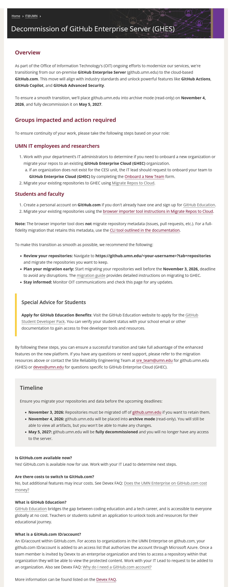

<!-- markdownlint-disable -->

<!-- _class: lead -->

# <!-- fit -->  Introduction to Github

### Kris Johnson | Tech Talk | 25 September 2026

---

# Overview

- What is Github?
- Why use GitHub?
- Github Migration
- Getting Started with GitHub

---

<!-- _class: lead -->

# What is GitHub?

---

# Github

### "The future of building happens together" 🥰

[Github](https://github.com/) is a platform for version control and collaboration, allowing multiple people to work on projects simultaneously. It uses Git, a distributed version control system, to track changes in source code during software development.

**tldr;
Github = code/files/data + version control + collaboration**

---

# Quick Glossary

**Version Control**: A system that records changes to files over time so that you can recall specific versions later.

**Repository (Repo)**: A storage location for code, documentation, and other project-related files. 
- Mechanically, think of it as a folder on your computer
- Structurally, think of it as a **project**.

**Issue**: A discussion thread for highlighting concerns and tracking tasks within a repository.

**Pull Request (PR)**: A request to make changes to the repo, often accompanied by feedback or a discussion, and a collective (and, nowadays, automated) code review.

---

<!-- _class: lead -->

# Why Use GitHub?

---

# Collaboration

Allows for project discussions and issue tracking among **technical and non-technical users** alike.

See the [Github is not just for coding article](https://dlab.berkeley.edu/news/github-not-just-coding-powerful-task-management-tool-your-back-pocket).

---

# Issues

## Issues 🟰 Conversations 🟰 Tasks

Example: Pursuit of Climate Data
- "We need climate data for our area of interest" ➡️ *(create issue)*
- "What sources?" "Which variables?" "What time period?" *(discuss)*
- "I can look into this" ➡️ *(assign tasks)* 
- 💬 *(iterate / continue discussion)* 
- "All set" ➡️ *(close issue when task is complete)*

---

# Collaboration Example

## https://github.com/umn-umd-nrri/nra-map/issues/111

---

# Project Management

**Task Boards**: Plan, track, and manage tasks visually within a project.

**Milestones**: Set and track important project goals and deadlines.

**Roadmaps**: Visualize the project's progress and future plans.

**Delegation**: Assign tasks to team members efficiently.

---

# Project Example

https://github.com/orgs/dotnet/projects/135

---

# Publicizing or Sharing Your Work

### Reproducable science

Share your work and make it accessible to others on a public repo.

### Publish Outcomes

Make your research findings and project results available to the broader community via Github Pages.

### Private Repo + Public Page

This is a useful pattern where you keep your project files private to your team and only make the final outcomes publicly accessible via a GitHub Pages site.

### https://umn-umd-nrri.github.io/bird-group-biodiversity/

---

<!-- _class: lead -->

# Github Migration

---

# Moving from github.umn.edu to github.com

https://atlas.umn.edu/it-umn/decommission-github-enterprise-server-ghes

---

# Github Migration

## Important Dates

- Archive (read-only): **4 November, 2026**
- Decommission: **5 May, 2027**

## [Migration Guide](https://github-docs.devex.oit.umn.edu/migration/)
- Simple browser tool
  - *Does not migrate issues and pull requests*
- Terminal-based tool that can be batched

Let me know if you have questions or need assistance.

---

<!-- _class: lead -->

# Getting Started with GitHub

---

# How to join NRRI's Github

1. Create a GitHub account at [github.com](https://github.com)

**IMPORTANT**: 
- You need to use your University e-mail when creating this account.
- If you already have an account you need to add your UMN e-mail to that account. 
https://github-docs.devex.oit.umn.edu/#login

2. Contact Kris Johnson (kristofj@d.umn.edu) or Jane Reed (jmreed@d.umn.edu) to let us know you want to join.
3. Accept the invitation to join NRRI's GitHub organization once you have been added.

###### Troubleshooting: look out for issues with your e-mail address getting truncated from **d.umn.edu** to **umn.edu**

---

<!-- _class: lead -->

# https://github.com/umn-umd-nrri

---

<!-- _class: lead -->

# Questions?

## Kris Johnson | kristofj@d.umn.edu | [github.com/kristofj-umd](https://github.com/kristofj-umd)